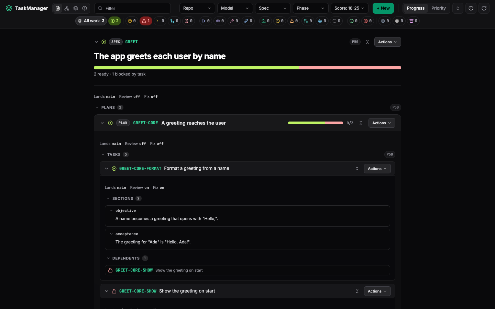

# TaskManager

[](https://github.com/TaigoPedrosa/TaskManager/actions/workflows/ci.yml)

A local task tracker for agents: a SQLite graph of specs, plans and tasks that claims each step of a node, lands finished work on its parent's branch or on the branch its spec targets, and verifies it there.



## Requirements

macOS or Linux; Windows is not supported: tm runs gates, conditions and landings in POSIX process groups and checks them with `ps`. Python 3.14 (uv fetches it); git; every repository tm lands into needs an `origin` remote with its default branch (`repos.<repo>.default_branch`, `main` unless set). The plugin runs in Claude Code.

Optional: [codegraph](https://www.npmjs.com/package/@colbymchenry/codegraph), a code index that implement, fix, review and plan agents query before reading files, and that `codegraph_query` verifications run against.

## Install

```bash
curl -fsSL https://raw.githubusercontent.com/TaigoPedrosa/TaskManager/main/install.sh | bash
```

or, from a clone, `./install.sh`. It installs `tm` with uv and the Claude Code plugin from the same git ref, `main` unless `--ref <ref>` names another, into the profile `CLAUDE_CONFIG_DIR` names (`~/.claude` when unset), and links the Gemini extension when `~/.gemini/extensions` exists. Pass arguments to the piped form after `bash -s --`:

```bash
./install.sh status        # tm, the plugin and their versions; non-zero when they differ
./install.sh uninstall     # removes what install created
./install.sh --from .      # installs tm and the plugin from this checkout
```

The plugin carries the skills, the `/taskmanager:init`, `:design`, `:plan`, `:tm`, `:task` and `:board` commands, the `tm-op` agent and the `tm-wave` workflow. `tm` and the plugin run at the same version; `install.sh` installs both, and `tm doctor` reports when they differ.

codegraph, the optional extra, installs on its own and indexes each repository once:

```bash
npm install -g @colbymchenry/codegraph
codegraph init <repository>
```

`tm doctor` lists what tm found: the required tools, and codegraph and each repository's index when present.

## Quickstart

A piece of work goes through four steps, then dispatch:

1. `tm init` prepares the project: the estate, the repositories and their gates.
2. `/taskmanager:init <source>` turns a tracker item, a file or your own words into a spec, with
   its open questions as decisions.
3. `/taskmanager:design <spec-id>` settles those decisions and writes the design into the spec,
   ending on an approval decision.
4. `/taskmanager:plan <spec-id>` turns the approved design into plans and tasks with `tm import`.

Then ask Claude Code for a wave: the plugin's dispatcher skill reads `tm guide dispatch` and runs
the `tm-wave` workflow. Without the plugin, write the import document by hand:

```bash
cd my-repo                      # a clone with its default branch on origin
tm init                         # asks for each setting, the gate included
tm guide plan                   # how to write plan.yaml
tm import --format yaml -f plan.yaml
tm wave discover --session me --slots 2 --max-strong 1
tm web
```

- `tm init` asks, at a terminal, for each setting not yet set: the repositories, their default
  branches, the worktree directory, each repository's gate and whether `.taskmanager/` is
  tracked. Re-running it asks only for what is still missing. In a script,
  `tm init --yes --gate .="<your test command>"` asks nothing and sets the gate; `tm guide overview`
  lists every flag.
- `.` names the repository when the tm root is the repository itself, and every task in
  `plan.yaml` names it in `target_repo`; with several repositories under one tm root, each is
  named by its directory.
- `<your test command>` is the gate tm runs on the merged tip before a landing pushes. It may use
  `{worktree}`, `{node}`, `{repo}` and `{target}`, each replaced shell-quoted; every other brace
  reaches the shell as written.
- A spec lands on its own branch, the one its `land_on` names, and on its repository's default branch (`main` unless set) without one.
- `tm wave discover` prints what is claimable without claiming it, and `tm web` opens the board.

## Features

- One stored status per node, moved only by `tm task start` and the verb that closes each step; blocked, waiting and stale are worked out, never stored
- `review`, `fix` and `merge` flags on every node in place of separate review and fix tasks, on plans and specs too
- Landings as detached jobs: merge, gate against a cached baseline of the target, push, verify
- Edges, decisions and conditions as the only things a node waits on, with a cycle check on every write
- `state.db`, `cache.db` and `audit.db` under `.taskmanager/`, SQLite in WAL mode, with `sqlite-vec` search
- The `tm-wave` workflow (`plugin/workflows/tm-wave.js`): one step per node per tick, on the model family tm names, with a dispatching session looping itself to carry a node the rest of the way

## Lifecycle

A node goes `READY`, `IMPLEMENTING`, `IMPLEMENTED`, then through review, fix and landing as its
`review`, `fix` and `merge` flags say. `tm guide overview` draws the whole cycle.

- Every spec lands on a target branch. Its `land_on` frontmatter names the feature, release or
  fix branch its work belongs to, and every node under it lands there; taking that branch on to
  environments and to `main` is yours. A spec with no `land_on` lands on
  `repos.<repo>.default_branch`, `main` unless set. `merge: spec` lands a node where its spec
  lands, and `merge: parent` on the branch of the plan or spec above it.
- Landing comes first. A plan or spec lands on its target once every child has landed on its
  branch; with `review` off that completes it, and with `review` on it reads `LANDED`: its code
  is on the target and its one review is owed.
- One review, on the landed target. It reads the container's whole landing, so its children
  take `review: false`, `fix: false` and `merge: parent` by default, and a sensitive child keeps
  `review` and `fix` on; an explicit flag on a child still wins, and a child with `review` off
  that would land on the spec's target is refused. An approval completes the container.
- Fixes land without a re-review. A rejection is fixed on a branch cut from the landed target,
  and that fix lands as soon as it is done. A task with `review` on is still reviewed before it
  lands, and its fix lands the same way.
- A sensitive node is the exception: its fix gets one re-review, scoped to the open findings,
  before it lands. `sensitive:` names the area as one of `tenant`, `rls`, `crypto` or
  `migration`, or a list of them (`sensitive: [tenant, rls]`); a node whose `declared_files`
  hold a path under `migrations/versions/` is sensitive without the key.

## Web

`tm web` serves the board on 127.0.0.1 by default: the page, its static assets, a live socket and a handful
of paginated reads. The socket protocol and the HTTP reads are in
[docs/web-protocol.md](docs/web-protocol.md).

- The toolbar holds four views, in order: Document, one card per spec/plan/task walked from the
  roots down; Graph, the node graph and inspector; Waves; and Decisions. Document opens first,
  for `tm web` and for a static export (`tm web export`) alike.
- The URL is the page's state. `/document`, `/graph`, `/waves` and `/decisions` name the view,
  and `/` opens Document. `/<view>/<id>` also selects a node, or in Decisions a decision:
  `/graph/API-AUTH`. Filters ride in the query string — `status`, `phase`, `repo`, `model`
  and `spec`, each with an `x`-prefixed exclude form (`xstatus`), plus `smin`, `smax`, `q` and
  `sort=priority` — so `/document?status=REVIEWING,FIXING&xrepo=web` is a link to share. An
  older link with its filters in the hash, `/#status=REVIEWING`, opens with them moved to the
  query string.
- A static export, opened from a file, has no paths of its own, so it carries the same path and
  query after `#/`: `spec-dashboard.html#/graph/API-AUTH?status=REVIEWING`. It has no server to
  simulate waves against, so it drops Waves and `#/waves` opens Document.
- Waves shows what `tm wave discover` would claim next, simulated forward from live state
  without claiming anything: a wave-size input, the same spec include filter as the graph view,
  a "Compute next wave" button that adds one wave on top of the last, and "Reset" back to wave
  1. Each card lists its claimable entries (action, model, repos, status before/after) and a
  collapsible "Held" list of what the wave skipped and why.
- Decisions lists open, answered and withdrawn decisions in three tabs; the Open badge tracks the
  live count. Opening a decision (`/decisions/<id>`) shows its question, context and options
  beside the list; below 640px the decision is the page and the list opens as a drawer over it.
  An open decision answers with a picked option or a custom answer, plus an optional rationale;
  withdrawing takes a reason, and either can be reopened.

## Upgrading from 0.2

0.3.0 does not open an estate written by 0.2: it refuses with the command to run. Export the old estate with the old version first; `tm init --archive` then moves the old files aside and starts fresh, and the work still in flight is re-imported. `tm guide overview` carries the whole runbook.

## Upgrading to 0.3.1

- `state.db` moves to schema 2 on first open (adds `nodes.rev` and its update triggers); a
  0.3.0 checkout still opens a 0.3.1 `state.db` unchanged, since 0.3.0 never reads that column.
- An `owed` section is refused on write. Register the owed work as its own spec, plan or task,
  depending on the node that owed it, instead of writing it into a section.
- The `tm-wave` workflow script and the `tm` binary upgrade together: the 0.3.1 script reads
  with `tm task get --fields`, which a 0.3.0 `tm` refuses as an unknown option, so a checkout
  pulled without reinstalling `tm` fails every read.

## Upgrading to 0.3.4

- `state.db` moves to schema 3, whose `nodes` table accepts `LANDED`, and 0.3.4 never migrates
  it on open. After installing 0.3.4, run `tm db migrate` once in each existing project.
- `tm db migrate` first copies `.taskmanager/state.db` to
  `.taskmanager/state.db.schema<n>.bak`, `<n>` being the schema it was at (2 for an estate
  0.3.3 wrote), then migrates it to schema 3.
- Until then every other command that opens the estate refuses with exit 1, naming
  `tm db migrate` and the backup path.

## Development

Python 3.14 through [uv](https://docs.astral.sh/uv/), Node 22 for the script tests, and the
Tailwind standalone CLI v3.4.19 for the stylesheet test.

```bash
uv sync
uv run pytest
node --test 'tests/**/*.test.mjs'
```

### Rebuilding the web stylesheet

`src/taskmanager/web/static/tailwind.css` is committed, built from `tailwind.config.js` and
`src/taskmanager/web/static/tailwind.input.css` by Tailwind's standalone CLI (no Node package,
pinned at v3.4.19). Fetch the binary for your platform from the release page and rebuild after
touching `tailwind.config.js`, the input stylesheet, or any file its `content` globs cover:

```bash
curl -sSL -o tailwindcss \
  https://github.com/tailwindlabs/tailwindcss/releases/download/v3.4.19/tailwindcss-macos-arm64
chmod +x tailwindcss
./tailwindcss -i src/taskmanager/web/static/tailwind.input.css -c tailwind.config.js \
  -o src/taskmanager/web/static/tailwind.css
```

Swap `tailwindcss-macos-arm64` for `tailwindcss-linux-x64`, `tailwindcss-linux-arm64`,
`tailwindcss-macos-x64` or a Windows build to match your platform.

`tests/web/stylesheet.test.mjs` rebuilds the sheet and fails when it differs from the committed
one. Without the CLI it fails too, never skips, so `node --test 'tests/**/*.test.mjs'` needs it.
The test looks at `TAILWINDCSS_BIN`, then `./tailwindcss` at the repository root, then `PATH`.
To keep the binary elsewhere, point the variable at it:

```bash
TAILWINDCSS_BIN=/path/to/tailwindcss node --test 'tests/**/*.test.mjs'
```

Run the build from the repository root: the `content` globs resolve against the working
directory, and from anywhere else the CLI finds no classes and writes a sheet without utilities.

## License

TaskManager is released under the [MIT License](LICENSE).
